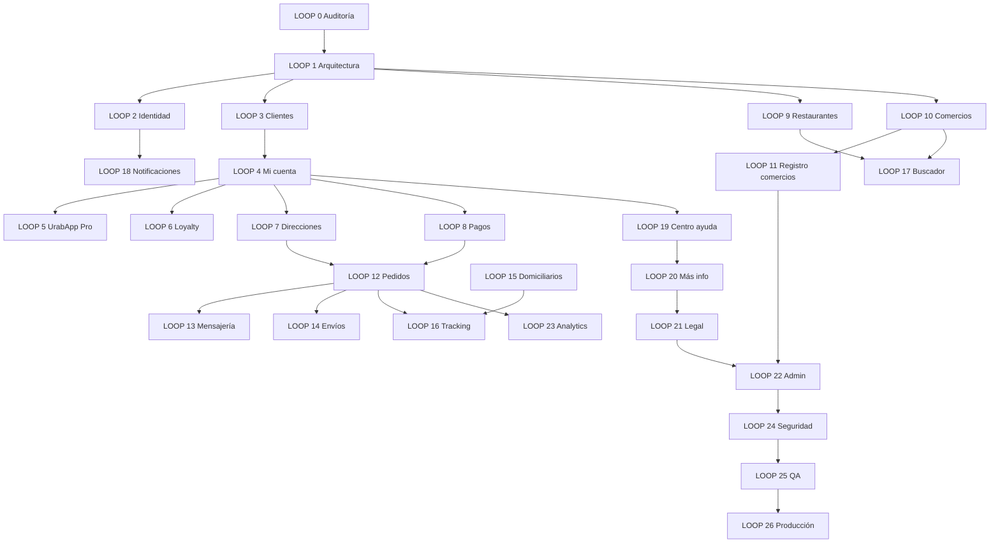

# UrabApp — ROADMAP MASTER BUILD LOOPS

**Visión:** Plataforma regional donde el cliente compra/paga/recibe, el comercio vende/opera/crece, el mensajero trabaja/cobra/entrega, y el administrador controla/aprueba/supervisa.

**Principio rector:** No avanzar si rompe módulos. Cada loop deja valor real — no paneles vacíos.

**Estado base (LOOP 0):** ~55–60% del producto completo. Ver `PROJECT_STATE.md` y `BACKLOG.md`.

---

## Mapa de dependencias



---

## Fases estratégicas

### Fase A — Fundación (Loops 0–4)
**Objetivo:** Base sólida + identidad + cuenta cliente completa.  
**Duración estimada:** 4–6 semanas  
**Gate:** Usuario puede gestionar perfil, direcciones, pagos y preferencias sin `/perfil` monolítico.

### Fase B — Monetización y confianza (Loops 5–8, 21)
**Objetivo:** Pro, wallet, pagos digitales, legal.  
**Duración estimada:** 4–5 semanas  
**Gate:** Wompi activo + páginas legales + consentimiento registrado.

### Fase C — Oferta comercial (Loops 9–11, 17)
**Objetivo:** Restaurantes y comercios con aprobación manual.  
**Duración estimada:** 3–4 semanas  
**Gate:** Ningún comercio público sin aprobación admin.

### Fase D — Operación entrega (Loops 12–16)
**Objetivo:** Pedidos, mandados, envíos, tracking unificado.  
**Duración estimada:** 3–4 semanas (mucho ya hecho)  
**Gate:** Cliente rastrea cualquier tipo de entrega en una UX consistente.

### Fase E — Retención y soporte (Loops 18–20)
**Objetivo:** Notificaciones, ayuda, landings informativas.  
**Duración estimada:** 2–3 semanas

### Fase F — Control y escala (Loops 22–26)
**Objetivo:** Admin completo, analytics, seguridad, QA, prod hardening.  
**Duración estimada:** 4–6 semanas  
**Gate:** Checklist producción verde + smoke tests en CI.

---

## Detalle por LOOP

| Loop | Nombre | Estado | Sprint | Entregable clave |
|------|--------|--------|--------|------------------|
| **0** | Auditoría total | ✅ | — | `PROJECT_STATE.md`, `BACKLOG.md`, `ROADMAP.md` |
| **1** | Arquitectura base | ⬜ | S1 | `src/domains/*` + `docs/ARCHITECTURE.md` |
| **2** | Identidad + config | 🟡 | S1 | `/configuracion`, settings store |
| **3** | Clientes | 🟡 | S2 | Recuperar cuenta, estados usuario |
| **4** | Mi cuenta | 🟡 | S2–S3 | `/cuenta/*` (12 secciones) |
| **5** | UrabApp Pro | ⬜ | S4 | Membresía + panel beneficios |
| **6** | Loyalty + cupones | 🟡 | S4 | Wallet unificado |
| **7** | Direcciones | 🟡 | S3 | Mapa + cobertura |
| **8** | Pagos | 🟡 | S4 | Wompi prod + métodos guardados |
| **9** | Restaurantes | 🟡 | S5 | Dominio menú/cocina/combos |
| **10** | Comercios | 🟡 | S5 | Estados + verificación |
| **11** | Registro comercios | 🟡 | S5–S6 | Aprobación manual obligatoria |
| **12** | Pedidos | ✅ | — | Mantener + reordenar + factura |
| **13** | Mensajería | ✅ | — | Mejoras ETA |
| **14** | Envíos | ✅ | — | Cobertura mapa |
| **15** | Domiciliarios | ✅ | S6 | Retiros bancarios |
| **16** | Tracking | 🟡 | S6 | Componente unificado |
| **17** | Buscador | ✅ | — | Voz/QR opcional |
| **18** | Notificaciones | 🟡 | S7 | Email + preferencias |
| **19** | Centro ayuda | 🟡 | S7 | FAQ + reportes |
| **20** | Más información | 🟡 | S7 | 4 landings |
| **21** | Legal | ⬜ | S4 | 5 páginas + versionado |
| **22** | Admin | ✅ | S8 | Moderación + auditoría |
| **23** | Analytics | 🟡 | S8 | Dashboard producto |
| **24** | Seguridad | 🟡 | S9 | Rate limit + fraude |
| **25** | QA | ⬜ | S9 | Playwright + CI |
| **26** | Producción | 🟡 | S10 | Monitoreo + runbook |

---

## LOOP 0 — Completado ✅

**Entregables:**
- [x] Escaneo pantallas, rutas, servicios, migraciones, estado
- [x] `PROJECT_STATE.md`
- [x] `BACKLOG.md`
- [x] `ROADMAP.md`
- [x] Sin modificaciones de código

**Hallazgos clave:**
1. Producto operativo en pedido/entrega — no empezar de cero.
2. Arquitectura actual es **por rol** (`client`, `business`, `rider`, `admin`), no por dominio puro.
3. Bloqueantes comerciales: legal, aprobación comercios, Wompi prod.
4. Panel mensajero y envíos están adelantados vs roadmap original `ROADMAP-FASES.md`.

---

## Próximo: LOOP 1 — Arquitectura base

### Objetivo
Separar dominios sin romper imports ni rutas:

```
auth · users · commerce · restaurants · delivery · shipments ·
orders · payments · loyalty · notifications · settings · support · admin
```

### Plan de ejecución (propuesto)

1. **Crear estructura** `src/domains/<domain>/` con:
   - `services/` — lógica de datos
   - `hooks/` — lógica React
   - `types/` o `constants/` — contratos
   - `index.js` — re-exports

2. **Migración incremental** — mover un dominio por PR:
   - Semana 1: `orders` + `payments` (más críticos)
   - Semana 1: `auth` + `users`
   - Semana 2: `commerce` + `restaurants`
   - Semana 2: `delivery` + `shipments`
   - Semana 3: `loyalty`, `notifications`, `settings`, `support`, `admin`

3. **Compatibilidad** — mantener `src/services/*.js` como re-exports deprecados hasta limpiar imports.

4. **Documentar** — `docs/ARCHITECTURE.md` con diagrama de dominios y reglas de dependencia (ej: `orders` → `payments`, nunca al revés).

### Criterios de aceptación LOOP 1
- [ ] Build pasa sin errores
- [ ] Todas las rutas funcionan igual
- [ ] Al menos 6 dominios migrados con re-exports
- [ ] Ningún dominio importa UI de otro dominio
- [ ] `docs/ARCHITECTURE.md` publicado

### Riesgos
| Riesgo | Mitigación |
|--------|------------|
| Romper imports `@/` | Re-exports en paths viejos |
| Scope creep | Solo mover archivos, no refactorizar lógica |
| Paralelismo con features | Congelar features durante migración dominio |

---

## LOOP 2 — Preview (después de LOOP 1)

- Configuración global en `settings` domain
- Pantalla `/configuracion` o `/cuenta/preferencias`
- Persist: idioma (es default), moneda COP, notificaciones default
- Integrar con `themeStore` existente

---

## Métricas de éxito producto (meta final)

| Actor | Métrica | Meta 90 días post-LOOP 26 |
|-------|---------|---------------------------|
| Cliente | Tasa checkout completado | > 65% |
| Cliente | Recompra 30 días | > 25% |
| Comercio | Tiempo aprobación | < 48 h |
| Comercio | Pedidos/semana activos | > 10 por comercio top |
| Mensajero | Entregas/día activo | > 8 |
| Mensajero | Tasa aceptación ofertas | > 70% |
| Admin | Pedidos sin asignar > 15 min | < 5% |
| Plataforma | Uptime | > 99.5% |

---

## Relación con `ROADMAP-FASES.md`

El roadmap por fases (0–6) cubrió validación MVP y lanzamiento Apartadó. **Este MASTER ROADMAP lo extiende** hacia producto regional completo:

| ROADMAP-FASES | MASTER LOOPS equivalentes |
|---------------|---------------------------|
| Fase 0–1 Validación | Loops 12, 15 (hecho) |
| Fase 2 Zonas | Loops 7, 10, 14 (hecho) |
| Fase 3 Producto mínimo | Loops 6, 18 (parcial) |
| Fase 4–5 Economía | Loops 8, 23 (parcial) |
| Fase 6 Post-MVP | Loops 1–5, 11, 21, 24–26 (pendiente) |

`ROADMAP-FASES.md` se mantiene como histórico; **`ROADMAP.md` es la fuente de verdad** a partir de jun 2026.

---

## Calendario sugerido (10 sprints × 2 semanas = ~5 meses)

| Sprint | Loops | Foco |
|--------|-------|------|
| S0 | 0 | ✅ Auditoría |
| S1 | 1, 2 | Arquitectura + config |
| S2 | 3, 4 (parte 1) | Auth + Mi cuenta rutas |
| S3 | 4 (parte 2), 7 | Mi cuenta completo + direcciones |
| S4 | 5, 6, 8, 21 | Pro + wallet + pagos + legal |
| S5 | 9, 10, 11 | Comercios con aprobación |
| S6 | 15, 16 | Retiros + tracking unificado |
| S7 | 18, 19, 20 | Notificaciones + ayuda + landings |
| S8 | 22, 23 | Admin moderación + analytics |
| S9 | 24, 25 | Seguridad + QA |
| S10 | 26 | Producción hardening |

---

## Reglas de ejecución por loop

En cada loop:

1. **Analizar** — leer `PROJECT_STATE.md` + backlog del loop
2. **Implementar** — cambios mínimos, valor real
3. **Validar** — `npm run build` + prueba manual del flujo
4. **Documentar** — actualizar los 3 MDs
5. **Actualizar backlog** — marcar items ✅/🟡/⬜
6. **Mostrar progreso** — % loop + siguiente propuesto
7. **NO avanzar** si build roto o regresión en pedido/entrega

---

## Decisión inmediata

**LOOP 0 completado.**  
**Proponer LOOP 1 — Arquitectura base** como siguiente paso.

Confirmación requerida del equipo para iniciar migración de dominios en código.
